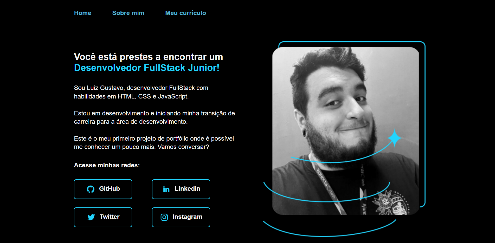

# Nome do projeto

<!---Esses são exemplos. Veja https://shields.io para outras pessoas ou para personalizar este conjunto de escudos. Você pode querer incluir dependências, status do projeto e informações de licença aqui--->

> Portifólio criado a partir dos módulos de HTML e CSS da Alura :)

## 🤝 Colaboradores

<table>
  <tr>
    <td align="center">
      <a href="#">
         
        
          <b>Luiz Gustavo</b>
        
      </a>
    </td>
 </tr>
</table>

